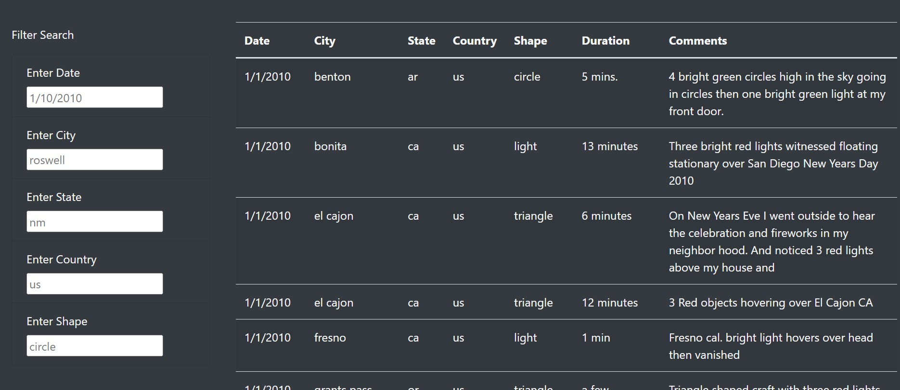
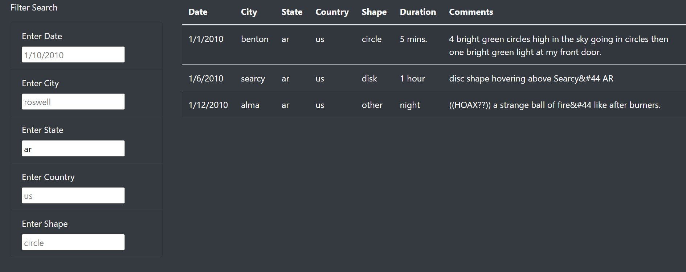
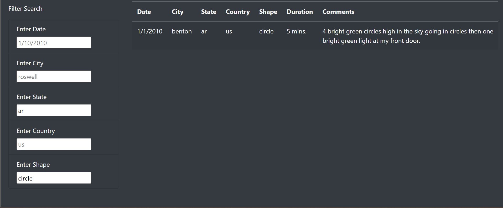
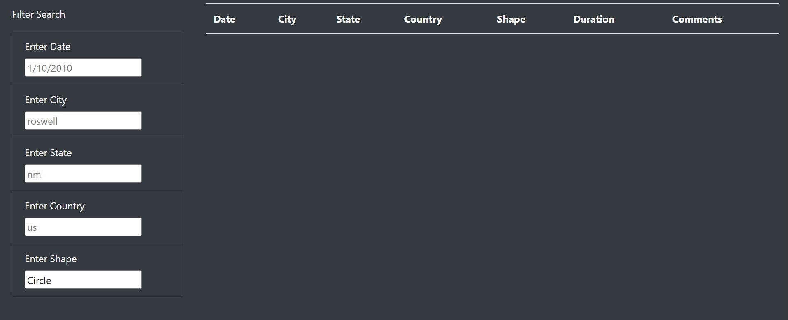

# ChallengeModule_12-UFO-Sightings-with-Javascript

Challenge Module_12-UFO Sightings-with-Javascript

## Overview of Project

Create a table to organize UFO data that is stored as a JavaScript array, or list. This table will have the ability to filter data based on certain criteria and will be created using JavaScript as the primary coding language. (From Module 12.0.2)

## Results

The bottom section of the website references data.js and is a searchable dataset.  To use the “Filter Search” you only need to enter data into the corresponding search box and click off the box on the webpage.  The “Filter Search” does accept multiple fields.  Screen shots are provided below showing the original page load, State code of “ar”, and Shape of Circle.

#### Data Table with no filters added

#### Data Table with State Filter "ar"

#### Data Table with State Filter "ar" and Shape "circle"

## Summary

The website while functional does have room for the following improvements:

•	The Data Set is a static file and would need to be manually updated.
    *If an online data set is available with an api then integration into it would allow the data set to update with new information automatically.
•	The “Filter Search” function is case sensitive and the date field is not standardized for the input to be a date.
    *The issues above allows for slight deviation in how a user inputs the fields to show no results. (Image below shown using “Circle” instead of “circle” and no results populating.

